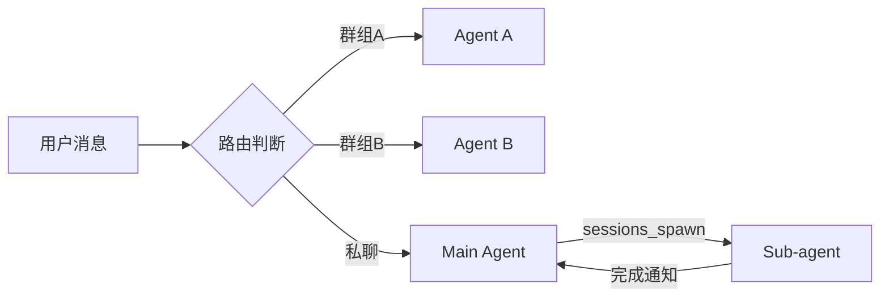

> **分类**：OpenClaw 核心概念
> **相关文档**：[[多Agent消息互通指南]]

# 架构概述

OpenClaw 支持多 Agent 协作，每个 Agent 有独立的：
- 工作空间（workspace）
- 人格定义（SOUL.md）
- 长期记忆（MEMORY.md）
- 技能配置

# Agent 类型

## Main Agent（主 Agent）

- 默认 Agent，处理私聊消息
- 协调其他 Agent
- 拥有完整的工具权限
- 加载 MEMORY.md（长期记忆）

## Isolated Agent（隔离 Agent）

- 独立会话，不共享上下文
- 用于定时任务（Cron）
- 执行后台任务

## Sub-agent（子 Agent）

- 由主 Agent 通过 `sessions_spawn` 创建
- 异步执行任务
- 完成后通知主 Agent

# 工作空间结构

```
~/.openclaw/
├── workspace/              # main Agent
├── workspace-media/        # 内容创作 Agent
├── workspace-coder/        # 开发 Agent
├── workspace-monitor/      # 监控 Agent
└── workspace-thinker/      # 分析 Agent
```

每个工作空间包含：
- `AGENTS.md` - 行为规范
- `SOUL.md` - 人格定义
- `USER.md` - 用户信息
- `MEMORY.md` - 长期记忆（仅 main）
- `HEARTBEAT.md` - 心跳任务
- `SHARED_RULES.md` - 共享规则

# 协作模式



# 配置示例

```json
{
  "agents": {
    "list": [
      {
        "id": "main",
        "name": "MoltBot",
        "default": true,
        "workspace": "/home/jun/.openclaw/workspace"
      },
      {
        "id": "media",
        "name": "墨客",
        "workspace": "/home/jun/.openclaw/workspace-media"
      }
    ]
  }
}
```

# 最佳实践

1. **职责分离** - 每个 Agent 专注一个领域
2. **共享规则** - 使用 `SHARED_RULES.md` 统一规范
3. **独立记忆** - 避免记忆污染
4. **明确路由** - 通过 `bindings` 清晰分配

# 相关

- [[Binding路由机制]]
- [[Session管理]]
- [[飞书多Agent路由配置]]
