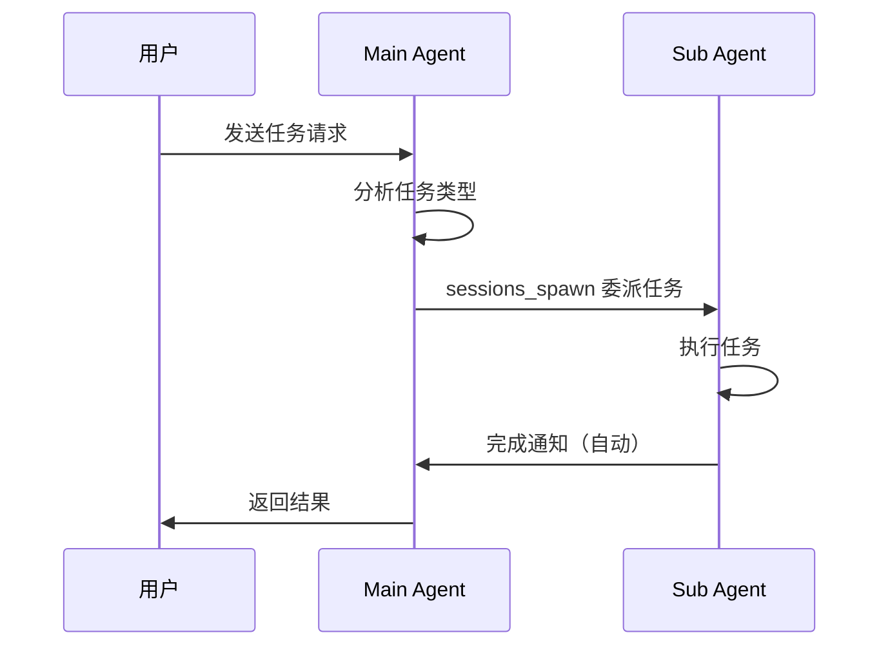

# 多 Agent 消息互通指南

> **分类**：OpenClaw 核心概念
> **相关文档**：[[多Agent架构详解]]

> 测试时间：2026-03-21
> 测试状态：✅ 全部通过

---

## 一、测试成果

| 功能 | 状态 | 说明 |
|------|------|------|
| 多 Agent 互发消息 | ✅ 通过 | Agent 之间可以相互发送消息 |
| 主 Agent 任务委派 | ✅ 通过 | main 可通过 `sessions_spawn` 调度子 Agent |
| 任务结果返回 | ✅ 通过 | 子 Agent 完成后自动通知主 Agent |

---

## 二、配置方法

### 2.1 开启子 Agent 调度权限

在 `openclaw.json` 中配置：

```json
{
  "agents": {
    "list": [
      {
        "id": "main",
        "name": "MoltBot",
        "default": true,
        "workspace": "/home/jun/.openclaw/workspace",
        "subagents": {
          "allowAgents": ["media", "thinker", "monitor", "coder"]
        }
      },
      {
        "id": "media",
        "name": "墨客",
        "workspace": "/home/jun/.openclaw/workspace-media"
      },
      {
        "id": "thinker",
        "name": "沉思",
        "workspace": "/home/jun/.openclaw/workspace-thinker"
      },
      {
        "id": "coder",
        "name": "极客",
        "workspace": "/home/jun/.openclaw/workspace-coder"
      },
      {
        "id": "monitor",
        "name": "哨兵",
        "workspace": "/home/jun/.openclaw/workspace-monitor"
      }
    ]
  }
}
```

### 2.2 关键配置项

| 配置项 | 作用 |
|--------|------|
| `subagents.allowAgents` | 允许调度的子 Agent ID 列表 |
| `default: true` | 标记为主 Agent |
| `workspace` | Agent 独立工作空间路径 |

---

## 三、使用方式

### 3.1 主 Agent 委派任务给子 Agent

使用 `sessions_spawn` 工具：

```
sessions_spawn({
  agentId: "coder",
  task: "帮我写一个 Python 爬虫脚本",
  timeoutSeconds: 300
})
```

参数说明：
- `agentId`: 目标 Agent ID
- `task`: 任务描述
- `timeoutSeconds`: 超时时间（可选）
- `model`: 指定模型（可选）

### 3.2 Agent 之间发送消息

使用 `sessions_send` 工具：

```
sessions_send({
  label: "media",
  message: "请帮我生成一篇小红书笔记"
})
```

参数说明：
- `label`: 目标 Agent 名称或 sessionKey
- `message`: 消息内容

### 3.3 查看子 Agent 状态

使用 `subagents` 工具：

```
subagents({ action: "list" })
```

---

## 四、工作流程



---

## 五、最佳实践

### 5.1 任务分发原则
- **main**: 协调、路由、决策
- **media**: 内容创作（小红书、文章）
- **thinker**: 技术调研、分析报告
- **coder**: 代码开发、脚本编写
- **monitor**: 监控、定时任务

### 5.2 超时设置建议
| 任务类型 | 建议超时 |
|----------|----------|
| 简单查询 | 60s |
| 内容生成 | 180s |
| 代码开发 | 300s |
| 复杂任务 | 600s |

### 5.3 避免循环调用
- 子 Agent 不应再调用主 Agent
- 避免形成调用环路
- 明确职责边界

---

## 六、常见问题

### Q1: 子 Agent 没有响应？
- 检查 `allowAgents` 配置
- 确认 Agent ID 正确
- 查看日志是否有错误

### Q2: 任务超时？
- 增加 `timeoutSeconds`
- 简化任务描述
- 检查子 Agent 是否正常运行

### Q3: 如何追踪子 Agent 任务？
```
subagents({ action: "list", recentMinutes: 30 })
```

---

## 相关笔记

- [[多Agent架构详解]]
- [[飞书多Agent路由配置]]
