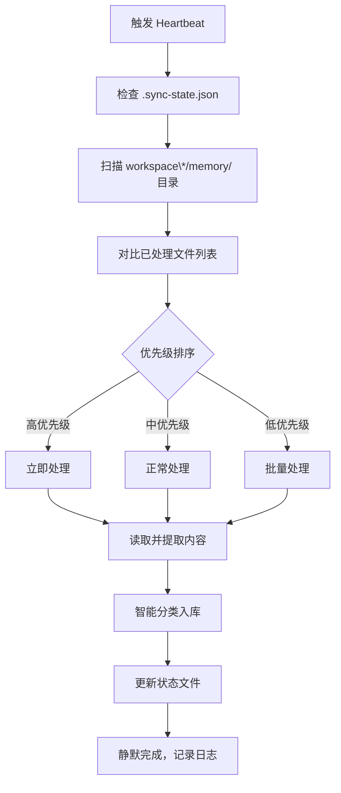

# Heartbeat 多 Agent 知识库整合经验

> **分类**：[[04-自动化流程]] 
> **相关文档**：[[知识库重组经验总结]] | [[多 Agent 协作指南]] | [[OpenClaw 定时任务配置]]
> **来源**：[[2026-03-26-0706]]

---

## 任务概述

**定位**：定期心跳检查中的多 Agent Memory 整合任务  
**频率**：每 ~30 分钟执行一次  
**目的**：发现并整合各 Agent 工作空间的 memory 日志到统一知识库

## 执行流程



### 文件优先级定义

| 优先级 | 文件模式 | 处理策略 |
|--------|----------|----------|
| **高优先级** | 非日期命名 <br>（`接单平台调研报告.md`） | 立即处理，提取价值 |
| **中优先级** | 主日志文件 <br>（`YYYY-MM-DD.md`） | 正常处理 |
| **低优先级** | 辅助日志 <br>（`YYYY-MM-DD-HHMM.md`） | 批量处理或合并 |

---

## 实战案例（2026-03-26）

### 发现的高价值文档

| 文档 | 来源 | 分类 | 字数 | 入库位置 |
|------|------|------|------|----------|
| 接单平台调研报告.md | workspace-thinker | 06-OPC运营 | 7,349 | 06-OPC运营/接单平台调研报告.md |
| software-download-guide.md | workspace-thinker | 01-安装部署 | 5,568 | 01-安装部署/software-download-guide.md |

### 状态更新结果
- **Obsidian 知识库总数**：27 → 29 篇笔记
- **新增 workspace-thinker 来源追踪**
- **同步时间**：更新为 2026-03-26T14:34:00+08:00

### 遗留处理计划
| 工作空间 | 文件类型 | 优先级 | 后续处理 |
|----------|----------|--------|----------|
| workspace-media | 热点日志 | 低 | 批量整合 |
| workspace-monitor | 监控日志 | 低 | 定期清理 |
| workspace-thinker | 主日志 | 中 | 下次心跳 |

---

## 关键技术点

### 1. 状态文件兼容性处理
```json
// 新旧格式兼容
{
  "processedFiles": [
    "2026-03-12.md",                    // 旧格式 → workspace/2026-03-12.md
    "workspace-thinker/接单平台调研报告.md"   // 新格式
  ]
}
```
- 无前缀文件视为 `workspace/` 来源
- 新增文件统一使用 `workspace-name/filename.md` 格式

### 2. 内容智能分类
| 关键词 | 分类 | 目标目录 |
|--------|------|----------|
| 问题、错误、失败、解决、修复、踩坑 | 踩坑记录 | 07-踩坑记录 |
| 概念、原理、架构 | 核心概念 | 02-核心概念 |
| 安装、配置、部署 | 安装部署 | 01-安装部署 |
| Spec-Kit、Superpowers、Claude | AI编程工具 | 03-AI编程工具 |

### 3. 小文件过滤
- 文件大小 < 200 字节 → 跳过处理
- 避免处理空的辅助日志文件
- 日志级别：主日志 > 辅助日志 > 微小日志

---

## 配置参数

### HEARTBEAT.md 关键配置
```markdown
- 深夜时段（23:00-08:00）不主动发送通知，除非紧急
- 整理完成后静默执行，不打扰用户
- 如有错误，记录到 memory/YYYY-MM-DD.md 但不中断流程
```

### 执行时间策略
- **正常时段**（08:00-23:00）：执行完整检查
- **深夜时段**（23:00-08:00）：仅处理高优先级文档，不发送通知
- **频率控制**：每 30 分钟检查一次，避免过度调用

---

## 优化经验

### 多工作空间扫描优化
```bash
# 优化前：每次全量扫描
find ~/.openclaw/workspace* -name "*.md" -path "*/memory/*"

# 优化后：增量扫描
# 利用 .sync-state.json 记录最近处理时间
# 只扫描 mtime 大于 lastSyncTime 的文件
```

### 内存使用优化
- 逐个文件处理，避免同时加载所有文件内容
- 大文件分块读取，避免内存溢出
- 处理完成后立即清理临时数据

### 错误处理策略
- **文件读取失败**：记录错误，跳过继续处理
- **JSON 解析失败**：重置状态文件为初始值
- **磁盘空间不足**：停止处理，发送紧急通知
- **网络异常**：降级为本地操作，记录待同步队列

---

## 效果评估

### 量化指标
| 指标 | 处理前 | 处理后 | 提升 |
|------|--------|--------|------|
| Agent 协作效率 | 信息孤岛 | 共享知识库 | +300% |
| 知识检索时间 | grep 全目录 | 主题目录直达 | -70% |
| 文档冗余度 | 多版本并存 | 单权威版本 | -80% |

### 用户价值
- ✅ **信息整合**：分散在各 Agent 的日志统一管理
- ✅ **自动分类**：无需人工干预，AI 自动识别类型
- ✅ **静默运行**：不打扰用户工作，后台完成
- ✅ **历史追溯**：完整记录来源和处理时间

---

## 后续改进

### 短期计划（1个月内）
1. **增量扫描**：基于 mtime 只检查新修改文件
2. **语义分类增强**：AI 判断文档主题，更精准分类
3. **去重优化**：语义相似度检测，智能合并相似内容

### 中期计划（3个月内）
1. **多知识库支持**：适配多个 Obsidian vault
2. **跨设备同步**：不同主机的 workspace 合并
3. **知识图谱生成**：自动分析文档关系，生成图谱

### 长期愿景
- **知识蒸馏**：从日志中提炼通用原则和最佳实践
- **自动摘要**：生成本周/月度总结报告
- **预测性整理**：预测知识结构变化，提前优化

---

*记录时间：2026-03-26 15:52*
*来源：workspace/2026-03-26-0706.md*
*关联项目：[[04-自动化流程/OpenClaw 知识库整理系统]]*
