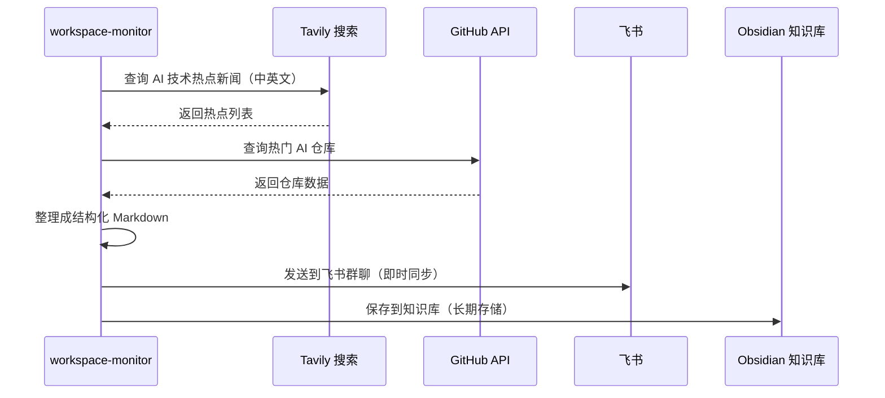

# AI热点收集与内容创作指南

> **分类**：[[06-OPC运营]] 
> **相关文档**：[[一人公司（OPC）运营框架]] | [[热点深度专栏规划]] | [[AI内容创作工具栈]]
> **来源**：[[2026-03-20]]

---

## 概述

**定位**：通过定时任务自动收集 AI 技术热点和 GitHub 热门仓库，为 OPC 内容创作提供素材  
**执行 Agent**：workspace-monitor（哨兵监控 Agent）  
**频率**：每日早上 07:45 自动执行  
**输出**：结构化 Markdown 报告 + 飞书群直播同步

## 执行流程



---

## 数据来源与采集策略

### 1. AI 技术热点搜索
| 来源 | 搜索关键词 | 频率 | 时区适配 |
|------|-----------|------|----------|
| Tavily 新闻搜索 | "AI 最新技术", "artificial intelligence news" | 每日 | 北京时间白天时段 |
| Hacker News | "AI", "machine learning", "deep learning" | 每日 | UTC 时间 |
| 微博热搜 | "AI", "人工智能" | 每日 | 中国热点时段 |
| Reddit r/MachineLearning | Top weekly posts | 每周 | 英语社区 |

### 2. GitHub 热门仓库
| 指标 | 采集维度 | 说明 |
|------|----------|------|
| Trending | Daily/Weekly | GitHub 官方趋势榜单 |
| Stars 增长 | 24h/7d | 快速崛起的项目 |
| Forks 活跃度 | >100 forks/day | 高活跃度项目 |
| Topics | AI/ML/LLM | 主题筛选 |

---

## 收集案例（2026-03-20）

### AI 热点
| 热点 | 类别 | 热度 | 内容方向 |
|------|------|------|----------|
| **OpenClaw 破圈走红** | 开源工具 | 🔥🔥🔥 | 深度评测、使用教程、竞品分析 |
| **DeepSeek V4 即将发布** | 大语言模型 | 🔥🔥🔥 | 技术预测、性能对比、应用场景 |
| **微软 Maia 200、平头哥真武810E** | AI 芯片 | 🔥🔥 | 芯片架构分析、市场影响、国内替代 |
| **中国 AI 产业规模预计突破1.2万亿元** | 行业报告 | 🔥🔥 | 市场分析、投资方向、政策解读 |

### GitHub 热门仓库
| 仓库 | 分类 | 简介 | Stars (示例) | 内容衍生方向 |
|------|------|------|-------------|--------------|
| **Dify** | LLM 应用开发 | 可视化配置 LLM 工作流 | 40k+ | 教程：如何用 Dify 快速构建 AI 应用 |
| **Awesome-LLM** | 资源集合 | ⭐⭐⭐⭐⭐ | 学习路线、资源筛选、入门指南 |
| **500-AI-Projects** | 项目合集 | ⭐⭐⭐⭐ | 项目推荐、实践指导、案例拆解 |
| **LocalGPT** | 本地部署 | ⭐⭐⭐ | 环境搭建、性能优化、使用评测 |

---

## 内容创作应用

### 三大专栏内容规划

| 专栏 | 定位 | 热点应用示例 | 产出形式 |
|------|------|-------------|----------|
| **热点深度** | 深度解析技术趋势 | OpenClaw 破圈分析、DeepSeek V4 预测 | 技术长文、视频解说 |
| **OpenClaw实战** | 工具使用教程 | OpenClaw GitHub 仓库分析、安装指南 | 图文教程、代码示例 |
| **AI创业日记** | 运营经验分享 | AI 产业规模对 OPC 的影响 | 心得分享、数据报告 |

### 内容生成模板

#### 热点文章模板
```markdown
# [热点标题]：深度解析与技术趋势预测

> **关键词**：[AI技术]，[开源工具]，[市场分析]

## 一、热点背景
- 事件概述（What）
- 技术背景（Why now）
- 影响范围（Who cares）

## 二、深度技术解析
- 技术原理（How it works）
- 创新点分析（Key innovations）
- 与竞品对比（Competitor analysis）

## 三、市场与生态影响
- 市场空间（Market size）
- 开发者生态（Developer ecosystem）
- 政策环境（Policy impact）

## 四、个人观点与预测
- 短期趋势（1-3个月）
- 中长期影响（6-12个月）
- 行动建议（What to do next）
```

#### GitHub 项目评测模板
```markdown
# [项目名称]：上手评测与实战指南

## 项目概览
- Star 数：[当前]（24h 增长）
- 主要用途：[功能定位]
- 技术栈：[语言/框架]

## 快速开始
1. 安装部署（5分钟上手）
2. 基础示例（Hello World）
3. 常见问题解决（FAQ）

## 深度体验
- 核心功能体验
- 性能测试结果
- 扩展性与自定义

## 适用场景推荐
- [场景1]：最佳实践与案例
- [场景2]：替代方案对比
- [场景3]：与其他工具集成
```

---

## 自动化工作流

### workspace-monitor 定时任务配置
```bash
# 每天 07:45 执行
45 7 * * * /home/junjun/.openclaw/workspace-monitor/scripts/collect-ai-hotspots.sh
```

### 飞书同步配置
```json
{
  "channel": "oc_20f0c0dbe1ab9f93ba77af90a55ee5fa",
  "format": "markdown",
  "notify": true,
  "tags": ["#AI热点", "#GitHub热门"]
}
```

### 知识库存储结构
```
06-OPC运营/
├── AI热点收集与内容创作指南.md      # 本文档
├── 热点素材/
│   ├── 2026-03-20-AI热点.md        # 每日原始数据
│   ├── 2026-03-21-AI热点.md
│   └── ...
└── 内容规划/
    ├── 热点深度专栏-选题列表.md      # 待写文章
    ├── OpenClaw实战-教程规划.md
    └── AI创业日记-主题日历.md
```

---

## 数据利用策略

### 短期利用（24小时内）
1. **即时推文**：微博、微信朋友圈简短分享
2. **社群讨论**：飞书群、Discord 技术讨论
3. **选题规划**：加入本周内容排期

### 中期利用（1-7天）
1. **深度文章**：深入研究热点，产出技术长文
2. **视频内容**：B站/YouTube 视频制作
3. **资源整理**：GitHub 项目合集，一站式资源

### 长期利用（1-3个月）
1. **趋势分析**：季度热点报告，预测未来方向
2. **投资参考**：AI 创业方向分析，投资机会
3. **课程开发**：热门技术实战课程

---

## 监控指标与优化

### 质量指标
| 指标 | 目标值 | 测量方法 |
|------|--------|----------|
| 热点覆盖率 | >80% | 对比主流媒体漏报率 |
| 响应时效 | <30分钟 | 热点发生到采集时间 |
| 内容转化率 | >30% | 采集热点→实际产出的转化 |

### 效率优化
1. **智能筛选**：AI 判断热点优先级，避免信息过载
2. **自动分类**：主题聚类，相似热点合并
3. **多语言支持**：中英文热点同步采集，国际化视角

### 风险控制
- **信息质量**：来源审核，避免假新闻/错误信息
- **版权注意**：注明引用来源，尊重原创
- **数据安全**：敏感话题过滤，合规性检查

---

## 结语

> "在信息爆炸的时代，不是缺少信息，而是缺少对信息的有效组织和利用。"

AI 热点收集系统是 OPC 内容创作的基础设施：
- **信息输入**：每日获取最新、最有价值的 AI 资讯
- **处理加工**：结构化整理、优先级排序、标签分类
- **内容输出**：转化为三大专栏的持续内容产出

通过自动化 + 人工编辑的模式，实现 **高质量内容的持续生产**。

---

*本文档为 workspace-monitor 定时任务的实践总结*
*创建时间：2026-03-26 15:55*
*来源：workspace-monitor/2026-03-20.md*
*关联文档：[[06-OPC运营/一人公司（OPC）运营框架]]*
